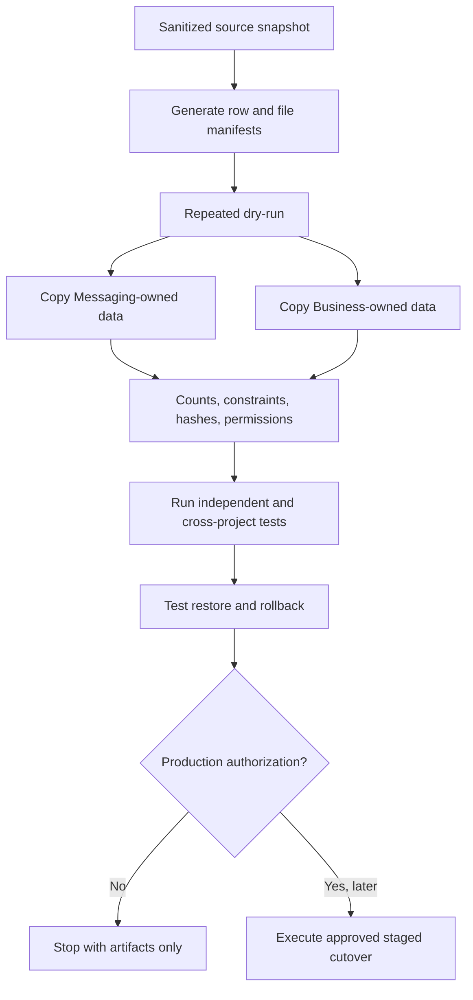

# Data migration plan

Status: **planned only — no live or local source data moved**

## Destination ownership

- Messaging database: `teleautomation_messaging`, least-privilege user `teleautomation_messaging`.
- Business database: `teleautomation_business`, least-privilege user `teleautomation_business`.
- Messaging storage: sessions, Telegram/WhatsApp media, campaign/forwarding files, call artifacts, exports, and temporary files.
- Business storage: candidates, resumes, proofs, interviews, offers, Data Room, finance attachments, reports, exports, and temporary files.

## Required migration properties

- Dry-run capable, resumable, idempotent where practical, secret-redacted, and source-preserving.
- Separate manifests for database records and files.
- Stable external IDs for relationships that cross the boundary.
- Row-count and aggregate validation for database objects.
- SHA-256 and size verification for files and Telegram sessions.
- Original files and tables remain intact through validation and rollback testing.

## Staging sequence

