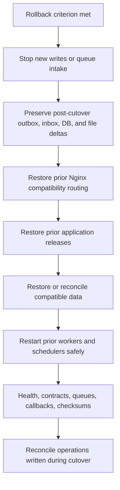

# Rollback plan

Status: **unverified; no rollback claim is made**

Rollback must independently cover application releases, workers, schedulers, database compatibility, file locations, Nginx routing, OAuth/webhook compatibility, and data written after cutover.

Rollback decision criteria, maximum downtime, and delta-reconciliation rules must be agreed before production authorization. The complete procedure must be tested against staging copies before it can be described as supported.
